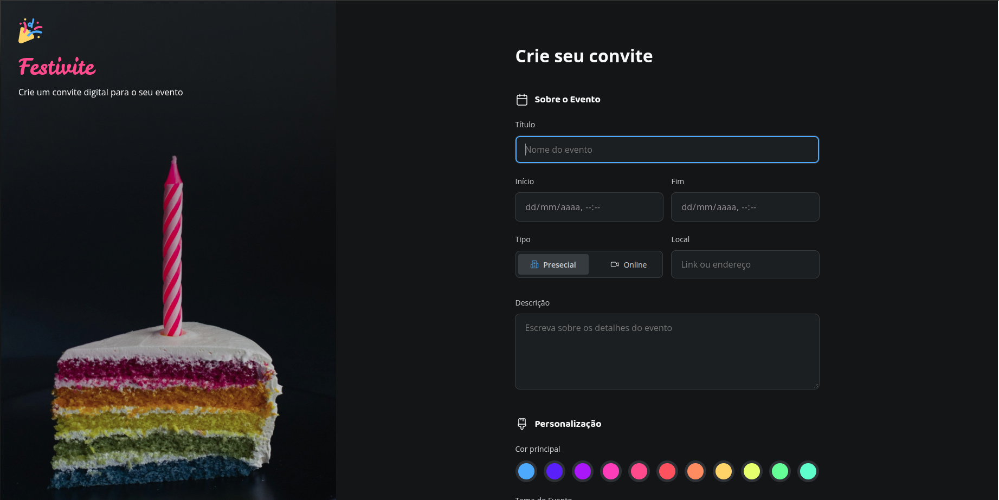
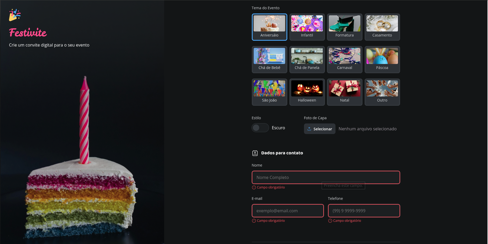
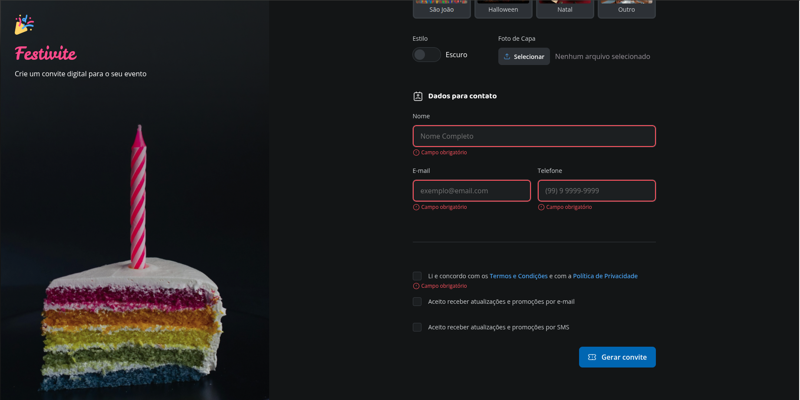

## 📑 Projeto: Festivite - Formulário de Criação de Convites

Este é o segundo projeto de estudo focado no desenvolvimento **front-end estático** utilizando exclusivamente **HTML5** e **CSS3** puro (Vanilla). Ele serve como um desafio para solidificar e expandir os conceitos de estruturação de formulários e estilização avançada praticados no projeto anterior.

### 🎯 Objetivo do Projeto (O Desafio Festivite)

O projeto Festivite consiste no desenvolvimento da interface de um sistema que permite aos usuários criar convites digitais personalizados para diversos tipos de eventos.

O foco é criar um **formulário extenso e detalhado**, garantindo a usabilidade e a aplicação de boas práticas de design. Os principais objetivos de aprendizado são:

1.  **Estrutura de Formulário Complexo:** Organizar um formulário com múltiplos _steps_ ou seções (dados do evento, personalização, contatos e termos) de forma lógica e acessível.
2.  **Aprofundamento em Inputs:** Explorar tipos de _inputs_ e elementos de formulário mais específicos, como seletores de cor, _upload_ de arquivo (apenas o _input_ visual), e _checkboxes/radios_ personalizados.
3.  **Estilização Avançada:** Aplicar técnicas de CSS para criar layouts mais sofisticados, incluindo a estilização de elementos complexos (como _file inputs_ e _ranges_), e garantir uma estética moderna e festiva.
4.  **Reafirmação do Conceito _Vanilla_**: Manter a aplicação totalmente livre de _frameworks_ e bibliotecas, reforçando o domínio do HTML e CSS nativo.

### 🛠️ Tecnologias Utilizadas

| Tecnologia | Descrição                                                                                                                   |
| :--------- | :-------------------------------------------------------------------------------------------------------------------------- |
| **HTML5**  | Para a marcação semântica e estruturação completa do formulário de criação de eventos.                                      |
| **CSS3**   | Para estilização, design responsivo (opcional, mas incentivado) e criação de um visual atraente para a aplicação Festivite. |

### ✨ Funcionalidades (Estáticas)

O formulário Festivite inclui campos para preenchimento das seguintes informações:

- **Informações Básicas:** Título, data, hora, local e descrição detalhada do evento.
- **Personalização:** Seleção de cores, escolha de tema e _upload_ de imagem de capa para o convite.
- **Detalhes Adicionais:** Campos de contato para RSVP ou dúvidas.
- **Conclusão:** Aceitação dos termos de serviço antes da "geração" estática do convite.

### 🖼️ Screenshots

Esta seção será preenchida com capturas de tela da aplicação após a conclusão da estilização.


|||
| :---------------------------------------: | :---------------------------------------: |
|  |  |

### 🚀 Como Visualizar

1.  **Clone o repositório:**
    ```bash
    git clone [LINK_DO_SEU_REPOSITORIO]
    ```
2.  **Navegue até a pasta do projeto:**
    ```bash
    cd festivite
    ```
3.  **Abra o arquivo `index.html`** no seu navegador de preferência para ver o formulário em ação.

---
